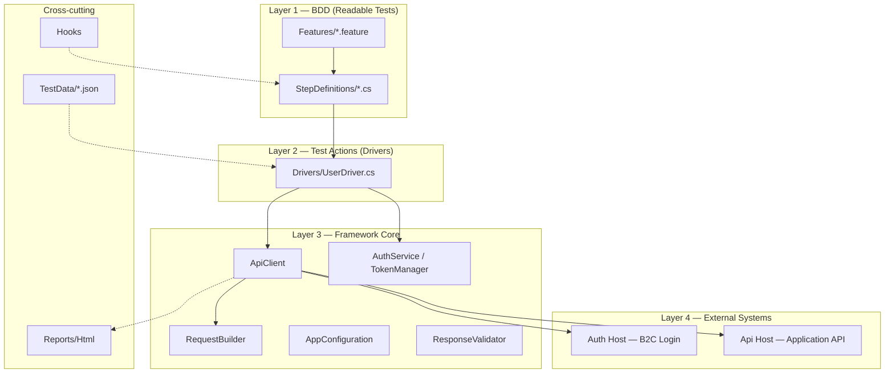
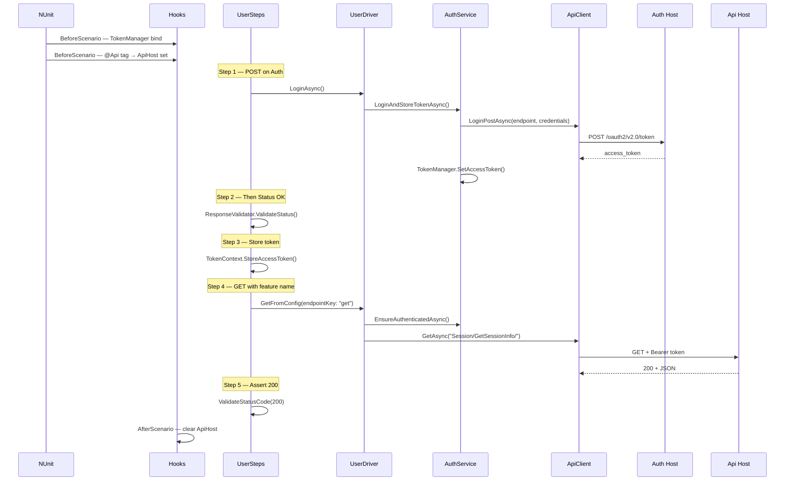
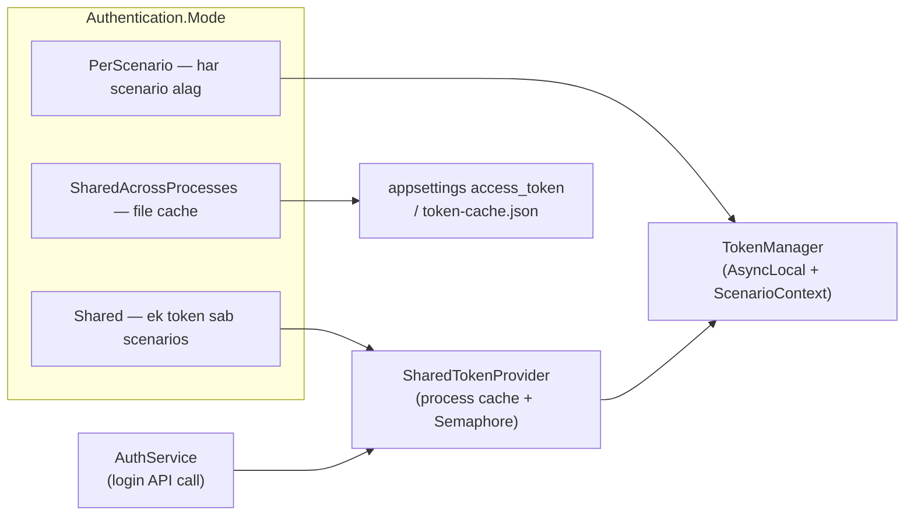
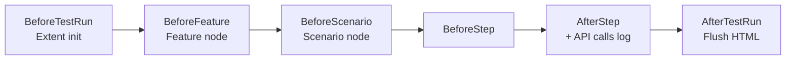

# Enterprise API Automation Framework — Architecture Guide (Hindi + Examples)

Yeh document project ki **poori architecture** step-by-step explain karta hai, taaki aap samajh saken: test kaise chalta hai, data kahan se aata hai, token kaise manage hota hai, aur naya test kaise likhna hai.

---

## 1. Yeh framework kya karta hai?

Yeh ek **BDD (Behavior Driven Development)** based **REST API test automation** project hai:

| Technology | Role |
|------------|------|
| **Reqnroll** (SpecFlow successor) | `.feature` files se readable tests |
| **NUnit** | Test runner |
| **RestSharp** | HTTP calls (GET, POST, PUT, PATCH, DELETE) |
| **FluentAssertions** | Response validation |
| **ExtentReports** | HTML test report |
| **appsettings.json** | Environment, URLs, token settings |

**Real-world use case:** Azure B2C se login token lo → us token se main API par CRUD operations test karo → reports generate karo.

---

## 2. High-level architecture (4 layers)



### Simple analogy (samajhne ke liye)

| Layer | Restaurant analogy |
|-------|-------------------|
| **Feature file** | Customer order slip ("burger + fries chahiye") |
| **Step Definitions** | Waiter — order ko kitchen ko batata hai |
| **Driver** | Chef — actual cooking (API call) |
| **Core (ApiClient, Auth)** | Kitchen equipment + recipes |
| **TestData / appsettings** | Pantry — ingredients (URLs, JSON bodies) |

---

## 3. Project folder structure

```
RestAPI_AutomationFramework/
│
├── Features/                    ← Gherkin tests (.feature)
│   ├── Login.feature
│   └── TokenRefresh.feature
│
├── StepDefinitions/             ← Feature steps ka C# code
│   ├── UserSteps.cs
│   ├── LoginSteps.cs
│   └── TokenSteps.cs
│
├── Drivers/                     ← API actions (Driver pattern)
│   └── UserDriver.cs
│
├── Hooks/                       ← Before/After scenario hooks
│   ├── AuthenticationHooks.cs
│   ├── ApiHostHooks.cs
│   └── ExtentReportHooks.cs
│
├── Core/                        ← Reusable framework engine
│   ├── Authentication/          ← Token, login, cache
│   ├── Builders/                ← RestRequest banana
│   ├── Clients/                 ← ApiClient, RestClientFactory
│   ├── Configurations/          ← appsettings read
│   ├── Validators/              ← Status code checks
│   ├── Reporting/               ← Extent HTML
│   └── ParallelExecution/       ← Parallel test orchestration
│
├── Models/                      ← Request/Response C# models
├── TestData/                    ← JSON payloads & endpoints
├── Reports/                     ← Generated HTML reports
├── appsettings.json             ← Main config
└── ParallelTestRunner/          ← Parallel run console app
```

---

## 4. Ek test ka complete flow (example ke saath)

### Example scenario (Login.feature se)

```gherkin
@Api
Scenario:2.Verify GET API to get CachedId
    When User sends POST request on "Auth" base url
    Then Status should be OK
    And the access token is stored from the last login response
    When User sends GET request for feature "User API Testing" with cached id
    Then Status code should be 200
```

### Flow diagram



### Har step mein kya hota hai (short)

| Gherkin step | Code file | Kya hota hai |
|--------------|-----------|--------------|
| `When User sends POST on "Auth" base url` | `UserSteps.cs` | `ApiHost = Auth` → `UserDriver.LoginAsync()` → B2C token API |
| `Then Status should be OK` | `UserSteps.cs` | Last response ka status `OK` hona chahiye |
| `And the access token is stored...` | `LoginSteps.cs` | Response se `access_token` nikal ke `TokenContext` mein save |
| `When User sends GET for feature "..."` | `UserSteps.cs` | `FeatureBaseUrlMap` se host resolve → GET call |
| `Then Status code should be 200` | `UserSteps.cs` | `ResponseValidator.ValidateStatusCode(200)` |

---

## 5. Layer-by-layer detail

### 5.1 Layer 1 — Feature files (`Features/`)

**Purpose:** Non-technical stakeholders bhi padh sakte hain; QA business language mein test likhta hai.

**Tags ka matlab:**

| Tag | Effect |
|-----|--------|
| `@Auth` | Automatically **Auth (B2C)** base URL use hoga |
| `@Api` | Automatically **Api (Application)** base URL use hoga |
| `@login` | Custom tag — filtering / grouping ke liye |

**Example — dynamic base URL (Scenario Outline):**

```gherkin
Scenario Outline: Dynamic base URL from step parameter
    When User sends GET request on "<BaseUrlType>" base url
    Then Status code should be <StatusCode>

    Examples:
      | BaseUrlType | StatusCode |
      | Api         | 200        |
```

Yahan step parameter se host choose hota hai — code duplicate nahi karna padta.

---

### 5.2 Layer 2 — Step Definitions (`StepDefinitions/`)

**Purpose:** Gherkin text ko C# methods se map karna (Reqnroll `[Binding]`).

**Example mapping:**

```csharp
// UserSteps.cs
[When(@"User sends POST request on ""(.*)"" base url")]
public async Task PostRequestOnBaseUrl(string baseUrlType)
{
    var host = ApiHostStepHelper.ApplyBaseUrlType(baseUrlType);
    SaveResponse(host == ApiHost.Auth
        ? await _driver.LoginAsync()
        : await _driver.PostUser(...));
}
```

**Important classes:**

| File | Responsibility |
|------|----------------|
| `UserSteps.cs` | GET/POST/PUT/PATCH/DELETE steps |
| `LoginSteps.cs` | Token store, invalid token login |
| `TokenSteps.cs` | Expired token, refresh flows |
| `ApiHostStepHelper.cs` | `"Auth"` / `"Api"` → `ApiHost` enum |

**Response kahan store hoti hai?**

- `ScenarioContext` — Reqnroll ka per-scenario dictionary
- `TokenContext` — last response + stored token helpers

---

### 5.3 Layer 3 — Drivers (`Drivers/UserDriver.cs`)

**Purpose:** Steps se **business-level API actions** hide karna. Steps ko `ApiClient` ki detail nahi pata.

**Example methods:**

```csharp
public Task<RestResponse> LoginAsync() =>
    AuthService.LoginAndStoreTokenAsync(_apiClient, forceRefresh: true);

public async Task<RestResponse> GetFromConfig(..., string endpointKey = "get")
{
    await AuthService.EnsureAuthenticatedAsync(_apiClient);  // token ensure
    ConfigReaderNew.LoadConfig(env);
    var endpoint = ConfigReaderNew.GetValue(endpointKey);
    return await _apiClient.GetAsync(endpoint, getOptions, host);
}
```

**Rule:** Naya API domain (e.g. `ProductDriver`) → naya driver class; steps us driver ko call karein.

---

### 5.4 Layer 4 — Core framework

#### A) `ApiClient` — HTTP facade

Sab HTTP calls yahan se jaati hain:

| Method | Host | Use |
|--------|------|-----|
| `LoginPostAsync` | **Auth** | B2C token (form body) |
| `GetAsync` / `PostAsync` / etc. | **Api** (default) | Application APIs |

Har call ke baad `ReportExecutionContext.RecordApiCall()` — Extent report mein request/response dikhe.

```csharp
// Simplified idea
var client = _clientFactory.GetClient(host);  // Auth ya Api RestClient
var response = await client.ExecuteAsync(request);
ReportExecutionContext.RecordApiCall(...);      // reporting
return response;
```

#### B) `RequestBuilder` — RestRequest banana

- Login: form parameters + optional Bearer
- Other verbs: JSON body + `Authorization: Bearer {token}`

```csharp
// Token automatically lagta hai agar TokenManager mein token ho
if (authorizationRequired && !string.IsNullOrEmpty(TokenManager.AccessToken))
    request.AddHeader("Authorization", $"Bearer {TokenManager.AccessToken}");
```

#### C) `RestClientFactory` — 2 base URLs

```json
// appsettings.json
"ApiUrls": {
  "AuthBaseUrl": "https://testRovicare.b2clogin.com/",
  "ApiBaseUrl": "https://apim-rc-test.azure-api.net/main/api/"
}
```

Ek `RestClient` per host cache hota hai (thread-safe).

#### D) `ApiHostContext` + Hooks

- Step ya tag se `ApiHost.Auth` ya `ApiHost.Api` set
- Scenario end par `ApiHostContext.Clear()`

```csharp
// ApiHostHooks.cs — @Auth / @Api tag se auto host
[BeforeScenario(Order = 1)]
public void ApplyBaseUrlTypeFromFeatureTags() { ... }
```

---

### 5.5 Authentication architecture



**Token flow (Shared mode — default):**

1. Pehli baar login → API se `access_token` → `TokenManager` + optional `appsettings.json` update
2. Agli scenarios → memory/cache se token reuse (dubara login nahi)
3. `EnsureAuthenticatedAsync` → agar token missing/expired → auto login

**Hooks:**

```csharp
// AuthenticationHooks.cs
[BeforeScenario]  → TokenManager.BindScenario + ResetForNewScenario
[AfterScenario]   → PerScenario mode mein token clear
```

**Example — token refresh test (`TokenRefresh.feature`):**

1. Valid token lo (Auth POST)
2. Expired token apply karo (`SharedTokenProvider.ApplyExpiredTokenForTesting`)
3. GET bhejo → expect **401**
4. Refresh karo → GET → expect **200**

---

### 5.6 Configuration system

**Load order (`AppConfiguration`):**

1. `appsettings.json`
2. `appsettings.{Environment}.json` (e.g. `appsettings.QA.json`)
3. Environment variables prefix `ROVI_`
4. `TEST_ENVIRONMENT` env var se environment name

**Important keys:**

| Key | Example | Purpose |
|-----|---------|---------|
| `Environment` | `QA` | Kaun sa env file merge ho |
| `ApiUrls:AuthBaseUrl` | B2C URL | Login host |
| `ApiUrls:ApiBaseUrl` | APIM URL | Main API |
| `FeatureBaseUrlMap` | `"User API Testing": "Api"` | Feature name → host |
| `EndpointJson` | path to JSON | Endpoint keys |
| `LoginJson` | path to JSON | Login credentials |
| `Authentication:Mode` | `Shared` | Token strategy |

**TestData example — endpoints:**

```json
// TestData/Request Endpoint/RequestEndPoint.json
{
  "get": "Session/GetSessionInfo/",
  "post": "testRovicare.onmicrosoft.com/.../oauth2/v2.0/token",
  "create_product": "/Product/Create"
}
```

**Driver endpoint kaise use karta hai:**

```csharp
ConfigReaderNew.LoadConfig("appsettings.json");
ConfigReaderNew.LoadConfig(ConfigReaderNew.GetValue("EndpointJson"));
var endpoint = ConfigReaderNew.GetValue("get");  // → "Session/GetSessionInfo/"
await _apiClient.GetAsync(endpoint, ...);
```

---

### 5.7 Validation (`Core/Validators/ResponseValidator.cs`)

Steps mein assertions yahan centralize hain:

```csharp
[Then(@"Status code should be (.*)")]
public void ValidateStatusCode(int statusCode) =>
    ResponseValidator.ValidateStatusCode(TokenContext.GetLastResponse(_context), statusCode);
```

FluentAssertions use hota hai — fail hone par clear message milta hai.

---

### 5.8 Reporting (`Hooks/ExtentReportHooks.cs`)



**Output path:** `Reports/Html/ApiTestReport_<timestamp>.html`

Har step ke saath us step ki API calls (method, URL, status, body snippet) attach hoti hain.

---

### 5.9 Parallel execution (optional)

**Sequential (normal):**

```bash
dotnet test
```

**Parallel (alag processes):**

```bash
.\scripts\run-parallel-tests.ps1
# ya ParallelTestRunner console
```

| Component | Role |
|-----------|------|
| `ParallelOrchestrator` | Features/scenarios discover → workers spawn |
| `ProcessIsolatedFeatureExecutor` | Har unit ke liye alag `dotnet test` |
| `ConsolidatedReportBuilder` | Sab workers ka merged dashboard |

**Output:** `Reports/Parallel/Consolidated/run_<timestamp>/`

Detail: `README_PARALLEL_EXECUTION.md`

---

## 6. Do hosts — Auth vs Api (important concept)

| | **Auth Host** | **Api Host** |
|---|---------------|--------------|
| **Base URL key** | `AuthBaseUrl` | `ApiBaseUrl` |
| **Typical use** | Login / token (OAuth ROPC) | Business APIs (GET session, CRUD) |
| **Step example** | `POST on "Auth" base url` | `GET on "Api" base url` |
| **Tag** | `@Auth` | `@Api` |

**Feature name se host (without typing Auth/Api in every step):**

```json
"FeatureBaseUrlMap": {
  "User API Testing": "Api",
  "Login": "Auth"
}
```

```gherkin
When User sends GET request for feature "User API Testing" with cached id
```

→ internally `Api` host select hota hai.

---

## 7. Naya test kaise add karein? (Step-by-step recipe)

### Case A: Existing steps se naya scenario

1. `Features/YourFeature.feature` mein scenario likho
2. Existing steps use karo (`UserSteps`, `LoginSteps`)
3. `dotnet test --filter "FullyQualifiedName~YourScenario"`

**Example:**

```gherkin
Feature: Product API

  @Api
  Scenario: Create product returns success
    When User sends POST request to create on "Api" base url
    Then Status should be OK
```

### Case B: Naya endpoint

1. `TestData/Request Endpoint/RequestEndPoint.json` mein key add karo:

```json
"get_products": "/Product/List"
```

2. Agar body chahiye → `RequestBody.json` mein entry
3. `UserDriver` mein method (optional) ya existing `GetFromConfig` use karo
4. `UserSteps` mein naya `[When]` agar naya Gherkin pattern chahiye:

```csharp
[When(@"User sends GET request for products list")]
public async Task GetProducts() =>
    SaveResponse(await _driver.GetFromConfig(endpointKey: "get_products"));
```

### Case C: Naya validation step

```csharp
[Then(@"response should contain product id")]
public void ThenResponseContainsProductId()
{
    var response = TokenContext.GetLastResponse(_context);
    ResponseValidator.ValidateResponseContains(response, "productId");
}
```

---

## 8. Run commands cheat sheet

| Command | Kya hota hai |
|---------|--------------|
| `dotnet restore` | Packages download |
| `dotnet build` | Compile + Reqnroll code generate |
| `dotnet test` | Saare tests + sequential Extent report |
| `dotnet test --filter "Category=login"` | Sirf `@login` tagged (agar filter setup ho) |
| `.\scripts\run-parallel-tests.ps1` | Parallel + consolidated dashboard |

**Environment change:**

```powershell
$env:TEST_ENVIRONMENT = "Staging"
dotnet test
```

---

## 9. Design patterns used (interview / learning ke liye)

| Pattern | Project mein kahan |
|---------|-------------------|
| **BDD** | `.feature` + Step Definitions |
| **Driver Pattern** | `UserDriver` — steps se API logic alag |
| **Builder** | `RequestBuilder` — complex RestRequest |
| **Factory** | `RestClientFactory` — client creation |
| **Singleton (static)** | `AppConfiguration`, `ExtentReportManager` |
| **Facade** | `ApiClient` — simple methods over RestSharp |
| **Hooks (AOP style)** | Token reset, reporting, host selection |

---

## 10. Quick troubleshooting

| Problem | Check |
|---------|-------|
| 401 on API calls | `TokenManager.HasToken`? Login step pehle chala? |
| Wrong host URL | `@Api`/`@Auth` tag? `ApplyBaseUrlType("Auth")` step? |
| Endpoint not found | `RequestEndPoint.json` key spelling |
| Stale token | `Authentication:Mode`, `access_token` in appsettings, delete cache file |
| Report empty | `Reports/Html` folder, `ExtentReportHooks` running? |
| Config not picked | Run from project output dir / `CopyToOutputDirectory` on appsettings |

---

## 11. Related documents

| File | Content |
|------|---------|
| `README.md` | Quick start |
| `PROJECT_STRUCTURE.md` | Har file ka short description |
| `README_PARALLEL_EXECUTION.md` | Parallel run detail |
| `README_ENTERPRISE_ENHANCEMENTS.md` | Enterprise features |

---

## 12. One-page summary (yaad rakhne ke liye)

```
.feature (Gherkin)
    ↓
StepDefinitions (map steps to C#)
    ↓
Driver (business API actions)
    ↓
AuthService + TokenManager (token)
    ↓
ApiClient + RequestBuilder (HTTP)
    ↓
RestClientFactory → Auth URL OR Api URL
    ↓
Response → Validators + Extent Report
```

**Data sources:** `appsettings.json` + `TestData/**/*.json`  
**Cross-cutting:** `Hooks/` (token, host, report)

---

*Document version: May 2026 — RestAPI_AutomationFramework / EnterpriseApiAutomationFramework*
