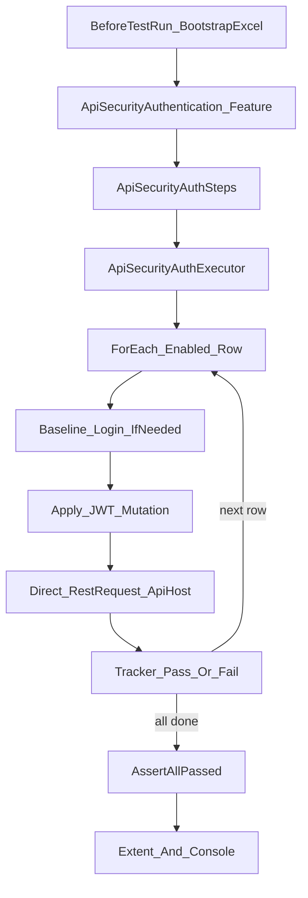

# API Security Authentication — Process Flow & Implementation Guide

**Module:** P0 Authentication (JWT-gate)  
**Status:** Phase 0 + Phase 1 implemented  
**Date:** 2026-09-28  
**Rule:** Existing Login / Authorization / TokenRefresh behaviour was **not** changed.

---

## 1. What this module does

This module verifies that **protected Api endpoints reject broken or missing JWTs**.

It is **not** a second login framework. It reuses:

- Existing B2C login (`UserDriver` → `AuthService`)
- Existing endpoint registry (`RequestEndPoint.xlsx`)
- Existing soft-assert tracker (`AuthorizationExecutionTracker`)
- Existing Extent reporting hooks

It follows the same idea as the P0 matrix sheet `02_Authentication`:

```text
For each protected endpoint
  × JWT mutation (no token, empty, invalid, malformed, expired, tampered, missing Bearer)
  → Expect HTTP 401
  → Request must not succeed as an authenticated call
```

---

## 2. Scope implemented (Phase 1)

| Item | Value |
|------|--------|
| Endpoints | `get`, `getExistingUser`, `getCheckAvability` |
| Mutations | 7 ScenarioTypes (see §5) |
| Total seed rows | 21 (3 × 7) |
| Expected status | `401` |
| Data file | `TestData/UploadFiles/ApiSecurityAuthMatrix.xlsx` |
| Feature | `Features/ApiSecurityAuthentication.feature` — **21 readable scenarios** (one per mutation) + 1 ExcelLoop batch; each tagged with API path e.g. `@[api/v2/Session/GetSessionInfo/]` |

**Deferred (later phases):** Wrong issuer/audience, missing claim, Patient/Referral OpenAPI scale-out, CI pipeline.

---

## 3. End-to-end process flow

```text
┌─────────────────────────────────────────────────────────────────┐
│ 1. TEST RUN START                                               │
│    ApiSecurityAuthHooks.BeforeTestRun                           │
│    → Ensure ApiSecurityAuthMatrix.xlsx exists (bootstrap seed)  │
│    → Ensure LoginRequest.xlsx + RequestEndPoint.xlsx exist      │
└───────────────────────────────┬─────────────────────────────────┘
                                ▼
┌─────────────────────────────────────────────────────────────────┐
│ 2. FEATURE SCENARIO (one of 21 readable scenarios, or ExcelLoop)│
│    Example tags:                                                │
│    @Security @Authentication @P0 @Session                       │
│    @[api/v2/Session/GetSessionInfo/]                            │
│    When API Security runs authentication test "AUTH-GET-01"     │
│    Then all authorization executions should pass                │
│                                                                 │
│    OR batch:                                                    │
│    When API Security executes all authentication tests from Excel│
└───────────────────────────────┬─────────────────────────────────┘
                                ▼
┌─────────────────────────────────────────────────────────────────┐
│ 3. STEP → HELPER / EXECUTOR                                     │
│    Single-row: load Excel row by TestCaseId → mutate → call Api │
│    ExcelLoop: ApiSecurityAuthExecutor (all Enabled rows)        │
│    → AuthorizationExecutionTracker                              │
└───────────────────────────────┬─────────────────────────────────┘
                                ▼
┌─────────────────────────────────────────────────────────────────┐
│ 4. PER CASE                                                     │
│    A. Baseline login if mutation needs a real JWT               │
│    B. Apply ScenarioType mutation (see §5)                      │
│    C. Build RestRequest DIRECTLY (no appsettings token reload)  │
│    D. Execute against ApiHost.Api                               │
│    E. Compare actual status vs ExpectedStatus (supports 401|400)│
│    F. Record PASS/FAIL in AuthorizationExecutionTracker         │
└───────────────────────────────┬─────────────────────────────────┘
                                ▼
┌─────────────────────────────────────────────────────────────────┐
│ 5. FINAL ASSERT                                                 │
│    Then all authorization executions should pass                │
│    → AuthorizationExecutionTracker.AssertAllPassed              │
└───────────────────────────────┬─────────────────────────────────┘
                                ▼
┌─────────────────────────────────────────────────────────────────┐
│ 6. REPORTING                                                    │
│    ExtentReportHooks log scenario/step                          │
│    Console + NUnit Progress: PASS/FAIL summary per row          │
└─────────────────────────────────────────────────────────────────┘
```

### Mermaid view



---

## 4. Architecture & file map

```text
Features/
  ApiSecurityAuthentication.feature          ← NEW scenario entry

StepDefinitions/
  ApiSecurityAuthSteps.cs                    ← NEW When bindings
  AuthorizationSteps.cs                      ← REUSED Then step (unchanged)

Hooks/
  ApiSecurityAuthHooks.cs                    ← NEW workbook ensure

Core/Security/Authentication/                ← NEW module
  ApiSecurityAuthConstants.cs
  ApiSecurityAuthEntry.cs
  ApiSecurityAuthBootstrap.cs
  ApiSecurityAuthMatrixReader.cs
  ApiSecurityAuthHelper.cs                   ← login + mutate + send
  ApiSecurityAuthExecutor.cs                 ← soft-assert loop

Core/Authentication/
  TokenTestHelper.cs                         ← EXTENDED (additive methods only)
  AuthService / TokenManager / ApiAuth       ← REUSED (unchanged)

TestData/UploadFiles/
  ApiSecurityAuthMatrix.xlsx                 ← created on first run if missing
  LoginRequest.xlsx                          ← credentials (unchanged)
  RequestEndPoint.xlsx                       ← endpoint paths (unchanged)
```

### Responsibility split

| Class | Single job |
|-------|------------|
| `ApiSecurityAuthBootstrap` | Create Excel + seed 21 rows if missing |
| `ApiSecurityAuthMatrixReader` | Read Enabled rows into DTOs |
| `ApiSecurityAuthEntry` | Map one Excel row |
| `ApiSecurityAuthHelper` | One row: login → mutate → HTTP call |
| `ApiSecurityAuthExecutor` | Loop all rows + summary log + tracker |
| `ApiSecurityAuthSteps` | Gherkin binding only |
| `TokenTestHelper` | Supply garbage / malformed / expired tokens |

---

## 5. ScenarioType → mutation mapping

**Pass/fail rule:** Expected status is `401` (or `401|400` for ExistingUser).  
API returns that reject status → **TEST PASS**. API returns `200` with protected data → **TEST FAIL** (security defect). Do not change ExpectedStatus to greenwash.

| ScenarioType | Baseline login? | What is sent | Token source |
|--------------|-----------------|--------------|--------------|
| `NoAuthHeader` | No | No `Authorization` header | — |
| `EmptyBearer` | No | `Authorization: Bearer ` (empty token) | — |
| `InvalidToken` | Yes | `Bearer abc123-invalid-token` | `GetInvalidAccessToken()` |
| `MalformedToken` | Yes | `Bearer not-a-valid.jwt` | `GetMalformedAccessToken()` |
| `ExpiredToken` | Yes | Structurally valid JWT with past `exp` (original signature kept) | `GetStructurallyExpiredAccessToken(valid)` via `JwtTokenHelper.WithExpiredExpClaim` — **not** `ExpiredAccessToken.json` |
| `TamperedToken` | Yes | Valid JWT with a payload claim changed (e.g. `sub`); original signature kept | `GetTamperedAccessToken(valid)` via `JwtTokenHelper.TamperPayloadClaim` |
| `MissingBearer` | Yes | `Authorization: <raw token>` (no `Bearer ` prefix) | Current login token |

### Tampering the access token (post-login)

Token is **not** changed at login time. Flow:

```text
1. LoginAsync → valid JWT (header.payload.signature)
2. TamperPayloadClaim → change a claim (e.g. sub → sub-TAMPERED)
3. Rebuild JWT as header.newPayload.originalSignature  (signature NOT regenerated)
4. Call protected API with Bearer <tampered JWT>
5. Expect 401  → PASS   |   200 with data → FAIL (API not validating signature)
```

**Readable Session scenarios (TC_06 / TC_13):**

```gherkin
Given User has a valid access token on "Auth" base url
When User applies a tampered access token
When User sends GET request on "Api" base url with current token only
Then the API status code should be 401
```

Flow: capture valid JWT → mutate claim → upload **unauthorized** bearer (Session rejects claim-only keep-signature with 200) → GET with explicit Bearer → assert **401 Unauthorized**.

`GetExpiredAccessToken` / `ExpiredAccessToken.json` remain for **TokenRefresh** only and are unchanged.

### Why requests are built directly

`UserDriver.SendFlexibleRequestAsync` calls `ApiAuth.LoadTokenFromAppSettings()`, which would **reload a valid token from `appsettings.json` and wipe the mutation**.

Therefore `ApiSecurityAuthHelper` builds `RestRequest` via `RestClientFactory` and sets `Authorization` explicitly. This is intentional and required for correct security testing.

---

## 6. Excel matrix format

**File:** `TestData/UploadFiles/ApiSecurityAuthMatrix.xlsx`  
**Sheet:** `Authentication`

| Column | Example | Meaning |
|--------|---------|---------|
| TestCaseId | `AUTH-GET-01` | Unique id |
| EndpointKey | `get` | Key in RequestEndPoint.xlsx |
| HttpMethod | `GET` | HTTP verb |
| ScenarioType | `NoAuthHeader` | Mutation name |
| Role | `SuperAdmin` | Role used for baseline login |
| ExpectedStatus | `401` or `401\|400` | Allowed rejection status(es); pipe-separated list supported |
| RequiresSession | `No` | Phase 1 keeps `No` |
| HeaderKeys | `-` | Optional headers (CacheId, …) |
| QueryParamKeys | `EmailId` or `-` | Extra query keys from config |
| Enabled | `Yes` / `No` | Include in ExcelLoop |
| Description | free text | Human note |

### Seeded TestCaseIds

| Endpoint | IDs |
|----------|-----|
| `get` | AUTH-GET-01 … AUTH-GET-07 |
| `getExistingUser` | AUTH-GETEXISTINGUSER-01 … 07 |
| `getCheckAvability` | AUTH-GETCHECKAVABILITY-01 … 07 |

Scenario order for `*-01` … `*-07`:  
NoAuthHeader → EmptyBearer → InvalidToken → MalformedToken → ExpiredToken → TamperedToken → MissingBearer

---

## 7. How to run

```powershell
# Build
dotnet build EnterpriseApiSecurityAutomationFramework.csproj

# Run only API Security Authentication ExcelLoop
dotnet test EnterpriseApiSecurityAutomationFramework.csproj --filter "FullyQualifiedName~ApiSecurityAuthentication"

# Or by tag (Reqnroll/NUnit category mapping depends on runner config)
dotnet test --filter "TestCategory=Security"
```

### Debug a single row

```gherkin
When API Security executes authentication test "AUTH-GET-01"
Then all authorization executions should pass
```

(Step already exists in `ApiSecurityAuthSteps`.)

### Calibrate after first QA run (Phase 2)

If an endpoint returns `403` instead of `401`:

1. Open `ApiSecurityAuthMatrix.xlsx`
2. Change `ExpectedStatus` for that row only
3. Or set `Enabled=No` to temporarily skip

Do **not** change existing AuthorizationMatrix.xlsx for this.

---

## 8. Console output example

```text
=====================================
API Security Authentication — Run Summary
Total Enabled Rows : 21
=====================================
PASS | AUTH-GET-01 | NoAuthHeader | GET get | status=401
PASS | AUTH-GET-02 | EmptyBearer | GET get | status=401
FAIL | AUTH-GET-05 | ExpiredToken | GET get | expected=401 actual=400
...
=====================================
```

Final Then step fails with aggregated failure list if any row failed.

---

## 9. Existing framework pieces reused (unchanged)

| Component | Path | Use |
|-----------|------|-----|
| Login | `Drivers/UserDriver.cs`, `AuthService.cs` | Baseline valid JWT |
| Token store | `TokenManager`, `SharedTokenProvider`, `ApiAuth` | Apply / clear tokens |
| Expired helper | `TokenTestHelper.GetExpiredAccessToken` | ExpiredToken case |
| Endpoints | `EndpointConfig` / RequestEndPoint.xlsx | Path resolution |
| Placeholders | `EndpointHelper.ResolveEndpoint` | `{EmailId}` etc. |
| Tracker | `AuthorizationExecutionTracker` | Soft-assert aggregate |
| Then step | `AuthorizationSteps` → `all authorization executions should pass` | Final assert |
| Reporting | `ExtentReportHooks` | Scenario HTML |
| Roles | `RoleProvider` + LoginRequest.xlsx | SuperAdmin credentials |

---

## 10. What was deliberately NOT changed

- `Features/Login.feature`
- `Features/Authorization.feature`
- `Features/TokenRefresh.feature`
- `AuthorizationHelper.ExecuteTokenScenarioAsync` (still Auth-host focused for old matrix)
- `AuthService`, `RequestBuilder`, `ApiClient` public contracts
- Existing `AuthorizationMatrix.xlsx` seed/rows

---

## 11. Phase roadmap (after Phase 1)

| Phase | Goal |
|-------|------|
| **2** | Calibrate ExpectedStatus on QA; optional body leak checks |
| **3** | Add Account/Member rejection rows (`post_Register` auth-only) |
| **4** | WrongIssuerAudience / MissingClaim with fixture JWTs |
| **5** | Import more controllers from P0 matrix (Patient, Referral, …) |
| **6** | CI filter for `@Security @Authentication @P0` |

---

## 12. QA notes (negative auth — expected vs findings)

After correct token construction (payload-tamper + structural expired JWT):

| Case | If API enforces JWT | If QA ignores signature / exp (observed before) |
|------|---------------------|--------------------------------------------------|
| NoAuth / Empty / MissingBearer | **401 → PASS** | Usually **401 → PASS** |
| Invalid / Malformed | **401 → PASS** | Usually **401 → PASS** on Session |
| Expired / Tampered (correct construction) | **401 → PASS** | May return **200 → FAIL** = real security finding |
| `getExistingUser` bad JWTs | Prefer **401** | Often **400**; Excel allows `401\|400` |

Do **not** set ExpectedStatus to `200` to make Tampered/Expired green — that hides defects.

---

## 13. Troubleshooting

| Symptom | Likely cause | Fix |
|---------|--------------|-----|
| Baseline login failed | Bad credentials / Auth URL | Check LoginRequest.xlsx Roles + appsettings ApiUrls |
| All Expired/Invalid/Tampered behave the same | API rejects any bad JWT the same way | Expected; keep distinct ScenarioTypes for coverage clarity |
| Status 403 instead of 401 | App behaviour | Update ExpectedStatus in Excel (Phase 2) |
| Valid token used instead of mutated | Old code path via UserDriver flexible | Must use ApiSecurityAuthHelper direct RestRequest (already done) |
| Excel missing | First run should create it | Delete corrupted file → re-run; bootstrap recreates seed |
| `Then all authorization executions should pass` says no results | When step did not run / wrong feature | Ensure ExcelLoop scenario executed When step |

---

## 14. Implementation summary (Phase 1)

```text
Authentication APIs covered (framework keys):
1. get                      → api/v2/Session/GetSessionInfo/
2. getExistingUser          → api/Account/ExistingUser?emailId={EmailId}
3. getCheckAvability        → api/Member/CheckEmailAvailibility?...

Existing scenarios reused (not modified):
- Authorization ExcelLoop pattern
- TokenRefresh / Login login utilities

Existing step definitions reused:
- Then all authorization executions should pass

New scenarios created:
- Execute all authentication security tests from Excel

New step definitions created:
- When API Security executes all authentication tests from Excel
- When API Security executes authentication test "{testCaseId}"

Existing files modified (additive only):
- Core/Authentication/TokenTestHelper.cs (+GetInvalidAccessToken, +GetStructurallyExpiredAccessToken, +GetTamperedAccessToken; GetExpiredAccessToken unchanged)
- Core/Authentication/JwtTokenHelper.cs (+WithExpiredExpClaim, +TamperPayloadClaim)

New files created:
- Core/Security/Authentication/* (6 classes)
- Features/ApiSecurityAuthentication.feature
- StepDefinitions/ApiSecurityAuthSteps.cs
- Hooks/ApiSecurityAuthHooks.cs
- TestData/UploadFiles/ApiSecurityAuthMatrix.xlsx (auto-seeded)
- Docs/API_SECURITY_AUTHENTICATION_PROCESS_FLOW.md

Existing files NOT modified (behaviour):
- Login.feature, Authorization.feature, TokenRefresh.feature
- AuthService.cs, RequestBuilder.cs, AuthorizationHelper.cs, AuthorizationExecutor.cs

Tests executed:
- dotnet test --filter FullyQualifiedName~ExecuteAllAuthenticationSecurityTestsFromExcel

Result (live QA):
- Passed rows: 16 / 21
- Failed rows: 5 (security findings — see §12; suite intentionally stays red until API fixed)
- Skipped: 0

No existing scenario behavior was changed.
```

---

## 15. Quick mental model

```text
Excel row = one security experiment
Login     = get a real JWT (when needed)
Mutation  = break / remove that JWT
Call Api  = prove the API rejects it (401)
Tracker   = collect every experiment, fail once at the end
```

That is the entire Phase 1 Authentication security engine.
