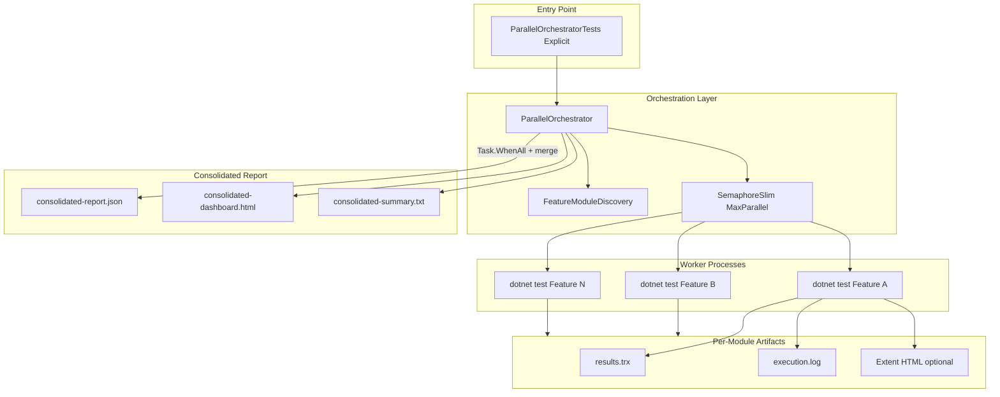

# Parallel Execution Framework (Consolidated Reporting)

This module runs **multiple SpecFlow feature files in parallel** and produces **one synchronized consolidated report** after all modules complete.

## Design goals

- **Backward compatible**: normal `dotnet test` behavior is unchanged.
- **Minimally invasive**: isolated under `Core/ParallelExecution/` + one explicit NUnit entry test.
- **Process isolation**: each feature runs in its own `dotnet test` process (avoids shared token/report race conditions).
- **Failure isolation**: one failed module does not stop others (`FailFast=false` by default).
- **Synchronized reporting**: consolidated JSON/HTML/table is generated only after `Task.WhenAll` completes.

## Architecture



### Pattern used

| Concern | Pattern |
|--------|---------|
| Orchestration | **Orchestrator** (`ParallelOrchestrator`) |
| Worker execution | **Process isolation** (one OS process per feature) |
| Concurrency control | `SemaphoreSlim` + `Task.WhenAll` |
| Retry | Configurable per-module retry loop |
| Result aggregation | **Aggregator** (`ConsolidatedReportBuilder`) |
| Discovery | Convention-based scan of `Features/*.feature` |

## Folder structure

```
Core/ParallelExecution/
  Configuration/ParallelExecutionSettings.cs
  Discovery/FeatureModuleDiscovery.cs
  Execution/
    ParallelOrchestrator.cs
    ProcessIsolatedFeatureExecutor.cs
    ParallelWorkScheduler.cs
  Models/
  Reporting/
    ConsolidatedReportBuilder.cs
    TrxResultParser.cs
ParallelExecution/
  ParallelOrchestratorTests.cs   # Explicit entry point only
Reports/Parallel/
  Workers/                       # per-module output
  Consolidated/                  # merged final report
```

## Why execution was sequential before

Running the orchestrator **inside** `dotnet test` (NUnit test host) locks the test DLL. Child `dotnet test` workers then queue behind that lock and run one-by-one.

**Fix:** use the **out-of-process** `ParallelTestRunner` console host so workers are true OS-level parallel processes.

## How to run

### 1) Normal sequential tests (unchanged)

```bash
dotnet test
```

Extent report continues to work exactly as before.

### 2) True parallel run + consolidated report (recommended)

```powershell
.\scripts\run-parallel-tests.ps1
```

Or:

```bash
dotnet run --project ParallelTestRunner/ParallelTestRunner.csproj
```

### 3) From IDE / NUnit (delegates to out-of-process runner)

```bash
dotnet test --filter "Category=ParallelOrchestrator"
```

This starts `ParallelTestRunner` as a separate process (no DLL lock).

## Configuration (`appsettings.json`)

```json
"ParallelExecution": {
  "Enabled": true,
  "Granularity": "Scenario",
  "MaxDegreeOfParallelism": 0,
  "RetryCount": 1,
  "RetryDelayMilliseconds": 2000,
  "ConsolidatedReportPath": "Reports/Parallel/Consolidated",
  "WorkerOutputPath": "Reports/Parallel/Workers",
  "FailFast": false
}
```

| Setting | Purpose |
|--------|---------|
| `Granularity` | `Scenario` = one worker per scenario (max parallelism). `Feature` = one worker per `.feature` file |
| `MaxDegreeOfParallelism` | Max concurrent workers. `0` = all units at once |
| `RetryCount` | Extra attempts after failed module run |
| `FailFast` | Stop all modules if one fails (default: false) |
| `ConsolidatedReportPath` | Final merged report folder |
| `WorkerOutputPath` | Isolated per-module logs/TRX/Extent |

## Consolidated report outputs

After completion, reports are written to:

`Reports/Parallel/Consolidated/run_<timestamp>/`

| File | Format | Purpose |
|------|--------|---------|
| `consolidated-report.json` | JSON | Machine-readable full run data |
| `consolidated-dashboard.html` | HTML dashboard | Human-readable summary + module table |
| `consolidated-summary.txt` | Table/text | Quick CLI-friendly summary |
| `chart-data.json` | JSON | Pie/timeline datasets for Chart.js dashboard |

The HTML dashboard (`consolidated-dashboard.html`) includes **Chart.js** visualizations:
- Features Passed vs Failed (pie)
- Scenario Distribution (pie)
- Step Status Summary (pie, aggregated from worker Extent reports when available)
- Execution Result Distribution (pie)
- Parallel Execution Timeline (horizontal Gantt-style bar chart with worker PID and overlap)

### Captured per module

- Module name
- Status (Success/Failed)
- Start/End time (UTC)
- Duration
- Exit code
- Scenario-level TRX results
- Logs (`execution.log`)
- Optional per-worker Extent HTML

## Error handling

- Worker process failures are captured and recorded; other workers continue.
- Retry re-runs only failed modules (based on process result/status).
- Orchestrator throws only for infrastructure failures (build failure, no features found, disabled config).

## Logging & monitoring

- Per-worker `execution.log` in `Reports/Parallel/Workers/<module>_<timestamp>/`
- Console summary printed once at the end
- TRX parsed for scenario-level pass/fail and error messages
- Existing Serilog file logging remains unchanged for sequential runs

## Scalability notes

- Increase `MaxDegreeOfParallelism` based on CPU/API capacity.
- Each worker is a separate process (higher isolation, slightly higher overhead).
- For very large suites, consider splitting features across CI jobs and merging JSON reports (future enhancement).

## Safe integration checklist

- Existing hooks (`ExtentReportHooks`) unchanged.
- Existing step definitions/drivers unchanged.
- Optional env override only: `PARALLEL_WORKER_REPORT_PATH` for worker Extent output path.
- Orchestrator test is `[Explicit]` and categorized, so default test runs are unaffected.

## Example workflow

1. CI/manual trigger runs parallel orchestrator.
2. Discovery finds `Features/*.feature`.
3. Build project once.
4. Launch up to `N` workers concurrently.
5. Each worker runs `dotnet test --filter FullyQualifiedName~<FeatureClass>`.
6. Worker writes TRX/log/Extent in isolated folder.
7. `Task.WhenAll` waits until every module completes.
8. Consolidated JSON/HTML/table is generated.
9. Pipeline fails if any module failed (assertion in orchestrator test).

## Troubleshooting

| Issue | Action |
|------|--------|
| Feature not discovered | Ensure `.feature` file exists under `Features/` |
| Wrong filter/class name | Verify SpecFlow generated class name matches discovery logic |
| Login dependency failures in parallel | Keep token scenarios isolated or run login feature first in CI |
| No consolidated report | Check `Reports/Parallel/Consolidated/run_*` and console summary |
